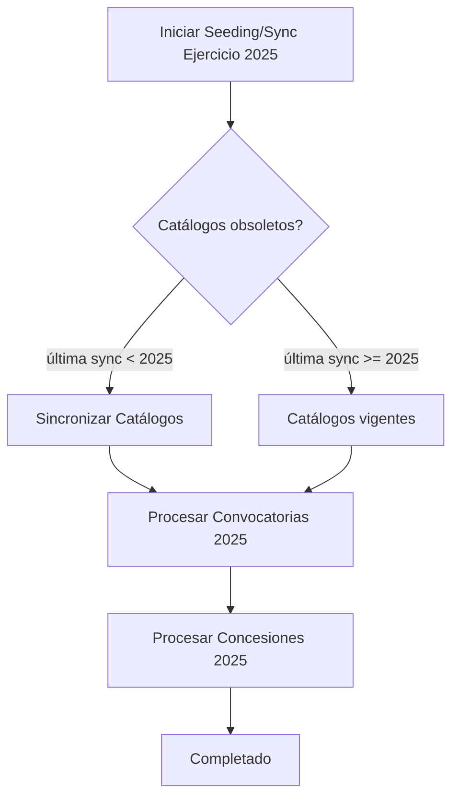

# Sistema de Validación y Sincronización de Catálogos

## Visión General

Este sistema garantiza que los catálogos de referencia estén actualizados **antes** de procesar datos transaccionales (convocatorias, concesiones).

### Regla de Obsolescencia

**Los catálogos se consideran obsoletos si:**
```
última_sincronización_catálogos < año_del_ejercicio_solicitado
```

**Entonces:**
1. Se sincronizar catálogos automáticamente desde API BDNS
2. Luego se procede con el seeding/sync de datos

### ¿Por qué es necesario?

Sin esta validación, pueden ocurrir errores como:

```
❌ BDNS añade nueva Finalidad(id=999) en 2025
❌ Nueva convocatoria 2025 referencia finalidad_id=999
❌ Nuestro sync intenta insertar la convocatoria
❌ FK constraint violation: Finalidad 999 no existe
```

Con validación automática:

```
✅ Detecta que catálogos están obsoletos (última sync < 2025)
✅ Sincroniza catálogos automáticamente (añade Finalidad 999)
✅ Ahora sí, procesa convocatorias 2025 sin errores
```

## Arquitectura

### Módulos

```
bdns_etl/sync/
├── catalog_sync_validator.py    # Validación de obsolescencia
├── sync_catalogos.py             # Sincronización desde API
└── sync_weekly.py                # Sync semanal con validación integrada
```

### Flujo de Ejecución



## Componentes

### 1. `catalog_sync_validator.py`

Detecta si los catálogos están obsoletos y ejecuta sincronización automática.

**Funciones principales:**

```python
def get_ultima_sync_catalogos(session: Session) -> datetime | None:
    """Retorna fecha de la última sincronización exitosa."""

def catalogos_obsoletos_para_ejercicio(session: Session, year: int) -> bool:
    """Determina si catálogos están obsoletos para un ejercicio."""

def validar_y_sincronizar_catalogos(session: Session, year: int) -> None:
    """Valida y sincroniza automáticamente si es necesario."""
```

**Ejemplos:**

```python
# Última sync: 2024-06-01, Ejercicio: 2025
>>> catalogos_obsoletos_para_ejercicio(session, 2025)
True  # Necesita sync

# Última sync: 2025-01-15, Ejercicio: 2025
>>> catalogos_obsoletos_para_ejercicio(session, 2025)
False  # Catálogos vigentes

# Última sync: 2025-12-31, Ejercicio: 2024
>>> catalogos_obsoletos_para_ejercicio(session, 2024)
False  # Catálogos más recientes, válidos
```

### 2. `sync_catalogos.py`

Sincroniza todos los catálogos desde la API BDNS.

**Características:**

- ✅ **UPSERT incremental**: Solo añade nuevos, nunca borra
- ✅ **Idempotente**: Puede ejecutarse múltiples veces sin duplicados
- ✅ **Tracking**: Registra ejecución en `etl_execution`
- ✅ **Reportes**: Informa cuántos valores nuevos se añadieron

**Catálogos sincronizados:**

- Órganos convocantes (central, autonómico, local, otros)
- Instrumentos
- Finalidades
- Fondos europeos
- Objetivos
- Regiones
- Reglamentos
- Sectores de actividad (CNAE)
- Sectores producto
- Tipos de beneficiario
- Regímenes de ayuda
- Formas jurídicas

**Uso standalone:**

```bash
cd /home/jose/dev/bdns/bdns_etl/sync
python sync_catalogos.py
```

**Uso programático:**

```python
from bdns_core.db.session import SessionLocal
from sync_catalogos import sync_catalogos

with SessionLocal() as session:
    resultado = sync_catalogos(session)
    print(f"Nuevos registros: {resultado['total_nuevos']}")
```

**Output:**

```
================================================================================
INICIANDO SINCRONIZACIÓN DE CATÁLOGOS DESDE API BDNS
================================================================================
--------------------------------------------------------------------------------
Sincronizando: Organo
Descripción: Órganos convocantes (central, autonómico, local, otros)
Registros antes: 1250
Registros después: 1255
✅ 5 nuevos registros añadidos
--------------------------------------------------------------------------------
Sincronizando: Finalidad
Descripción: Finalidades de las ayudas
Registros antes: 87
Registros después: 89
✅ 2 nuevos registros añadidos
--------------------------------------------------------------------------------
...
================================================================================
SINCRONIZACIÓN DE CATÁLOGOS COMPLETADA
Total de nuevos registros: 15
Duración: 12.34 segundos
================================================================================
```

### 3. `sync_weekly.py`

Sincronización semanal incremental con validación automática de catálogos.

**Características:**

- ✅ Validación automática de catálogos **antes** de sync
- ✅ Sincronización incremental por rango de fechas
- ✅ Tracking en `sync_control`
- ✅ Manejo automático de fechas (última sync + 1 día)

**Uso:**

```bash
# Sync de la última semana
python sync_weekly.py

# Sync de un rango específico
python sync_weekly.py --fecha-desde 2025-01-01 --fecha-hasta 2025-01-31

# Omitir validación de catálogos (NO RECOMENDADO)
python sync_weekly.py --skip-catalog-validation
```

## Integración en Seeding

### Ejemplo: Seeding de Ejercicio

```python
#!/usr/bin/env python3
from bdns_core.db.session import SessionLocal
from catalog_sync_validator import validar_y_sincronizar_catalogos

def seed_ejercicio(year: int):
    """Seeding de un ejercicio con validación automática."""

    with SessionLocal() as session:
        # ✅ PASO 1: Validar y sincronizar catálogos
        validar_y_sincronizar_catalogos(session, year)

        # ✅ PASO 2: Procesar convocatorias
        seed_convocatorias(session, year)

        # ✅ PASO 3: Procesar concesiones
        seed_concesiones(session, year)

if __name__ == "__main__":
    seed_ejercicio(2025)
```

### Script de Ejemplo

Ver [`seeding/seed_ejercicio_con_validacion.py`](../seeding/seed_ejercicio_con_validacion.py) para un ejemplo completo.

```bash
# Seeding con validación automática
python seeding/seed_ejercicio_con_validacion.py --year 2025

# Omitir validación (no recomendado)
python seeding/seed_ejercicio_con_validacion.py --year 2025 --skip-catalog-validation
```

## Tracking de Sincronización

Las sincronizaciones de catálogos se registran en la tabla `bdns_etl.etl_execution`:

```sql
SELECT
    execution_type,
    status,
    started_at,
    finished_at,
    records_processed,
    current_phase
FROM bdns_etl.etl_execution
WHERE execution_type = 'sync_catalogos'
ORDER BY started_at DESC
LIMIT 5;
```

**Ejemplo de resultado:**

| execution_type  | status    | started_at          | finished_at         | records_processed |
|----------------|-----------|---------------------|---------------------|-------------------|
| sync_catalogos | completed | 2025-02-10 14:30:00 | 2025-02-10 14:30:15 | 15                |
| sync_catalogos | completed | 2025-01-15 09:00:00 | 2025-01-15 09:00:12 | 8                 |
| sync_catalogos | completed | 2024-12-01 08:30:00 | 2024-12-01 08:30:10 | 3                 |

## FAQ

### ¿Cuándo se sincronizan los catálogos?

Los catálogos se sincronizan automáticamente cuando:

1. **Nunca se han sincronizado** (primera ejecución)
2. **Última sync es de un año anterior** al ejercicio que se va a procesar

### ¿Qué pasa si ejecuto sync_catalogos múltiples veces?

Nada. La sincronización es **idempotente**:
- Solo añade valores nuevos
- No duplica registros existentes
- No borra nada

### ¿Puedo omitir la validación de catálogos?

Técnicamente sí (usando `--skip-catalog-validation`), pero **NO ES RECOMENDADO**.

Omitir la validación puede causar:
- ❌ Errores de FK constraint violation
- ❌ Datos incompletos o inconsistentes
- ❌ Fallos en el ETL

### ¿Cuánto tarda la sincronización de catálogos?

Típicamente **10-20 segundos** para todos los catálogos.

Los catálogos son pequeños (<2000 registros cada uno), por lo que el overhead es mínimo.

### ¿Los catálogos se pueden borrar?

No. Los catálogos **solo crecen**, nunca se borran.

Si BDNS añade nuevos valores, se añaden a nuestra BD.
Si BDNS depreca un valor (poco común), se mantiene en nuestra BD para no romper referencias.

### ¿Qué pasa si hay un error en la sincronización?

Si `sync_catalogos()` falla:

1. La ejecución se marca como `status='failed'` en `etl_execution`
2. Se registra el mensaje de error
3. Se lanza una excepción (el proceso de seeding/sync se detiene)

Esto es **intencional**: es mejor fallar rápido que procesar con catálogos incompletos.

### ¿Cómo sé si mis catálogos están actualizados?

```python
from bdns_core.db.session import SessionLocal
from catalog_sync_validator import get_ultima_sync_catalogos, catalogos_obsoletos_para_ejercicio

with SessionLocal() as session:
    ultima_sync = get_ultima_sync_catalogos(session)
    print(f"Última sync: {ultima_sync}")

    obsoletos_2025 = catalogos_obsoletos_para_ejercicio(session, 2025)
    print(f"Obsoletos para 2025: {obsoletos_2025}")
```

## Mejores Prácticas

### ✅ DO

- Siempre usar la validación automática en seeding/sync
- Dejar que el sistema detecte obsolescencia automáticamente
- Revisar logs de sincronización para detectar nuevos valores

### ❌ DON'T

- No omitir `--skip-catalog-validation` en producción
- No asumir que catálogos están actualizados
- No sincronizar catálogos manualmente a menos que sea necesario

## Mantenimiento

### Sincronización Manual

Si necesitas sincronizar catálogos manualmente:

```bash
cd /home/jose/dev/bdns/bdns_etl/sync
python sync_catalogos.py
```

### Debugging

Para ver logs detallados:

```python
import logging
logging.basicConfig(level=logging.DEBUG)
```

### Monitoreo

Consulta `etl_execution` para ver historial de sincronizaciones:

```sql
-- Ver estadísticas de sync de catálogos
SELECT
    DATE(started_at) as fecha,
    COUNT(*) as num_syncs,
    SUM(records_processed) as total_nuevos_registros,
    AVG(EXTRACT(EPOCH FROM (finished_at - started_at))) as duracion_promedio_segundos
FROM bdns_etl.etl_execution
WHERE execution_type = 'sync_catalogos'
  AND status = 'completed'
GROUP BY DATE(started_at)
ORDER BY fecha DESC
LIMIT 30;
```

## Roadmap Futuro

- [ ] Notificaciones cuando se detectan nuevos valores en catálogos
- [ ] Dashboard de estado de catálogos en frontend ETL Admin
- [ ] Versionado de catálogos (tracking de cambios históricos)
- [ ] Sync selectivo (solo catálogos específicos)
- [ ] Comparación de diferencias entre syncs

## Soporte

Para problemas o preguntas:

1. Revisar logs en `logs/`
2. Consultar `etl_execution` para ver estado de sincronizaciones
3. Verificar conectividad con API BDNS: https://www.infosubvenciones.es/bdnstrans/api

---

**Última actualización:** 2025-02-10
